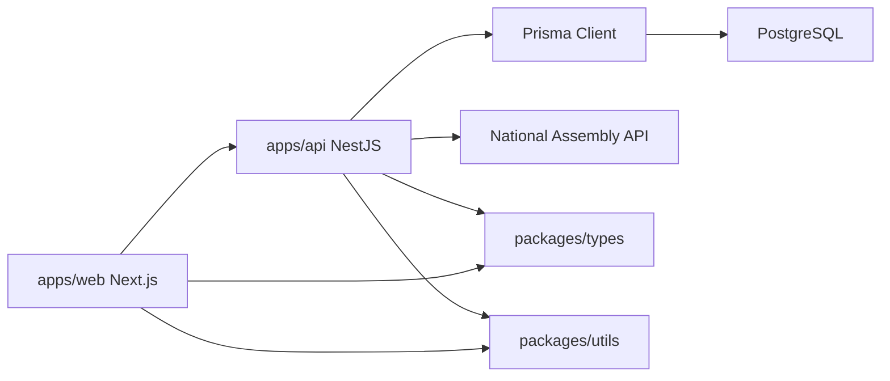

# Architecture

## Purpose

Civic Lens reorganizes National Assembly public data around citizen interests. It tracks changes in bills, members, districts, followed targets, and keywords without adding political scoring or editorial ranking.

## Core Domains

- `Bill`: National Assembly bill metadata, current status, committee context, and source identifiers.
- `Member`: Assembly member profile data and district relationship.
- `District`: Electoral district names and future geographic/search context.
- `Follow`: User interest targets. It starts with members but is shaped for `MEMBER`, `BILL`, `DISTRICT`, `KEYWORD`, and `COMMITTEE`.
- `ActivityEvent`: The canonical event stream for change tracking, feeds, alerts, and member activity views.

## System Shape

## Why ActivityEvent Centered

Civic Lens is a change tracking service, not only a lookup service. Source records such as bills and members represent state, while `ActivityEvent` records represent meaningful changes over time:

- new bill registration
- primary sponsorship
- co-sponsorship
- bill status changes
- committee referral
- plenary passage
- discard or withdrawal
- meeting remark additions

This lets the product build feeds, notifications, and activity timelines from one normalized event table.

## Module Boundaries

- `BillsModule`: bill read/write use cases after source field verification.
- `MembersModule`: member profile data. Bill sync can create temporary name-based records, then member sync promotes them to official `ALLNAMEMBER` records keyed by `NAAS_CD`.
- `DistrictsModule`: district lookup and future geographic exploration.
- `FollowsModule`: user interest graph.
- `ActivitiesModule`: normalized events and activity timeline writes. Bill sync currently emits bill registration, primary sponsorship, and co-sponsorship events.
- `ExternalApiModule`: source-specific clients and normalization.
- `SchedulerModule`: future recurring sync jobs and retry policy.
- `SyncLogsModule`: collection run history for success, failure, counts, and metadata.
